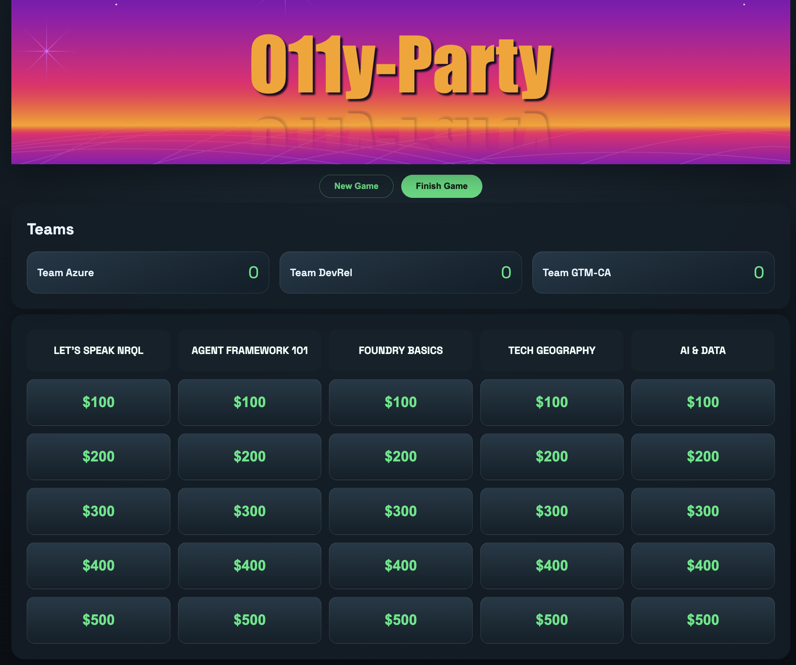
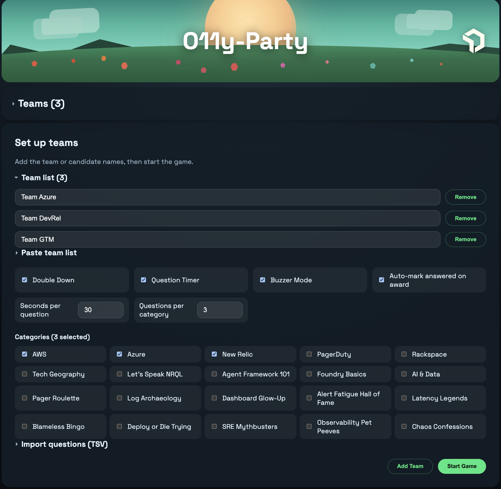
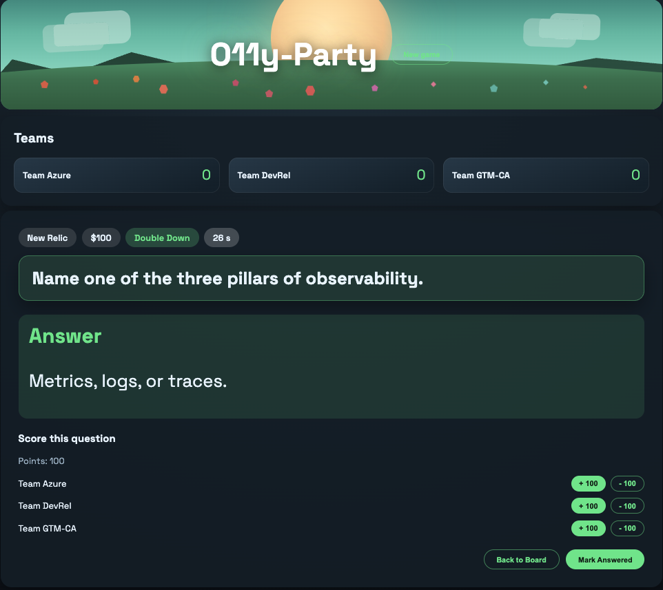
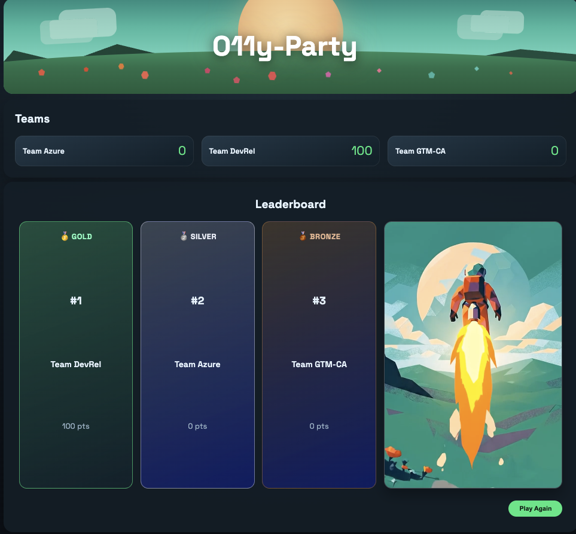

# O11yParty

> **Note:** This project works in concert with the companion buzzer app at <https://github.com/harrykimpel/O11yParty-Buzzer>.



This is a simple O11yParty-style game built with .NET 10 and ASP.NET Core Blazor.

It can be used for fun team-building activities, educational purposes, or as a template for building more complex quiz games. The game features a customizable board with categories and point values, and allows players to select clues, reveal answers, and keep track of their scores.

It also includes optional integration with New Relic Browser monitoring for insights into user interactions and game performance.

## Prerequisites

- .NET SDK 10.0 (or later)
  - Download from: <https://dotnet.microsoft.com/en-us/download>
- Optional: Visual Studio 2022/2025 or VS Code with the C# Dev Kit

## Getting Started

1. Open a terminal in this folder.
2. Restore dependencies:

    ```bash
    dotnet restore
    ```

## (optional) Configure New Relic Browser Monitoring

To enable New Relic Browser monitoring for this application, follow these steps:

1. Sign up for a New Relic account if you don't have one: <https://newrelic.com/signup>
2. Create a New Relic Browser monitoring application in your New Relic account to get the monitoring script.
3. Copy the New Relic Browser monitoring script provided by New Relic.
4. Open the file [wwwroot/newrelic.js](wwwroot/newrelic.js) in a text editor.
5. Paste the New Relic Browser monitoring script into the file, replacing the placeholder comment.
6. Uncomment the lines in the `RecordTeamScore` function to enable recording team names and scores as custom attributes in New Relic for better insights into user interactions and game performance.
7. Save the file.

## (optional) Buzzer Integration (New Relic)

The game can show which team buzzed in live, by polling New Relic for buzz events published by
the companion [O11yParty-Buzzer](https://github.com/harrykimpel/O11yParty-Buzzer) app. When a
new buzz is detected during a question, the team is highlighted and locked in. This is optional —
the game runs fine without it.

Configure under the `NewRelic` section of `appsettings.json` (or via `NewRelic__*` env vars):

| Key | Default | Notes |
| ----- | --------- | ------- |
| `AccountId` | _(required)_ | New Relic account ID to query |
| `UserApiKey` | _(required)_ | New Relic User API key (NerdGraph/NRQL) |
| `BuzzEventType` | `O11yPartyBuzz` | Custom event type the buzzer writes |
| `BuzzNameAttribute` | `teamName` | Event attribute holding the team name |
| `NormalizeReBuzzSuffix` | `false` | When `true`, strips a trailing `-r<n>` from the polled team name so load-test re-buzz names map back to the base team. Leave off for normal play. |

A buzz only highlights a team that exists in the current team list (case-insensitive match), so
the buzzer's team names should match the names on the scoreboard.

## (optional) Sample New Relic Dashboard

A ready-made dashboard is included at [o11yparty-dashboard.json](o11yparty-dashboard.json). It
visualizes the data the game and buzzer send to New Relic:

- **Team Score** — current score per team (from the browser `RecordTeamScore` custom data, faceted by team).
- **Buzzes by team** — buzz counts from the buzzer's `O11yPartyBuzz` events.
- **Lead captures** — names and country from the buzzer's `O11yPartyLeadCapture` events.

To use it, in New Relic go to **Dashboards → Import dashboard**, paste the contents of
`o11yparty-dashboard.json`, and choose your account. If you customized any event/attribute names
(`EventType`, `BuzzEventType`, `BuzzNameAttribute`, …), update the matching NRQL in the widgets.

## Running the Game

1. Run the app:

    ```bash
    dotnet run
    ```

2. Open the URL shown in the terminal (typically `https://localhost:7xxx`).

## Customizing the Game

You can change the content by editing the data files **or** directly in the Setup screen at runtime:

- **Board content** lives in [wwwroot/data/O11yParty-board.json](wwwroot/data/O11yParty-board.json).
  - Prompts are the on-screen clues; answers are the responses.
  - The board is **tier-based**: each category provides questions at point levels (100, 200, …),
    and one is picked at random per tier when the board is built.
- **Initial team names** live in [wwwroot/data/teams.json](wwwroot/data/teams.json).

### In the Setup screen (no redeploy needed)

- **Paste team list** — paste names (one per line or comma-separated) to override the teams
  loaded from `teams.json` for this session.
- **Import questions (TSV)** — paste tab-separated rows (`Category`, `Value`, `Prompt`, `Answer`,
  `DoubleDown`) — e.g. copy a range straight from Google Sheets/Excel. This **adds to** the
  current board: questions for an existing category name are appended; a new category name is
  created and auto-selected. Use values `100, 200, 300…` so they land on the board's point tiers.
  A sample file is included at [wwwroot/data/pets.tsv](wwwroot/data/pets.tsv).

## Game Controls

- Use **New Game** to reset teams and the board.
- Select a tile to reveal the clue.
- Use **Show Answer** to reveal the response.
- **Scoring:** award/deduct with the per-question buttons, or **click a team's score in the
  scoreboard and type a new total** to correct it directly. Each change shows a brief
  confirmation, and the per-question buttons are disabled for a few seconds after a click so
  points aren't double-applied by accident.
- When a team buzzes in, a banner appears just below the header (it doesn't cover the question).

## Chaos / Synthetic Failure Modes

O11yParty includes built-in synthetic failure modes useful for demonstrating observability tooling, practicing incident response, or running chaos engineering exercises during team-building sessions.

Modes are activated by appending a `?chaos=` query parameter to the URL. Multiple modes can be combined with commas.

| Mode | Behavior |
| --- | --- |
| `slowload` | Injects a 4-second artificial delay during app startup |
| `errors` | Randomly fails ~40% of question tile clicks with a recoverable in-app error message |
| `latency` | Adds a random 1.5–4 second delay before each question loads |
| `memleak` | Background task allocates ~1 MB every 3 seconds, holding references to prevent garbage collection |
| `timerdrift` | Question countdown timer ticks at 2× speed (500 ms instead of 1000 ms) |

**Example URLs:**

```plain
/?chaos=slowload
/?chaos=errors,latency
/?chaos=slowload,memleak,timerdrift,errors,latency
```

When any chaos mode is active, a red banner is displayed at the top of the app confirming which modes are enabled. All synthetic failures are also logged to stdout with a `[CHAOS]` prefix, making them easy to spot in application logs or in a New Relic dashboard.

## Troubleshooting

- If the HTTPS dev certificate is missing, run:

```bash
dotnet dev-certs https --trust
```

## Screenshots

### Setup View



### Start View


### Prompt View



### Winner View


